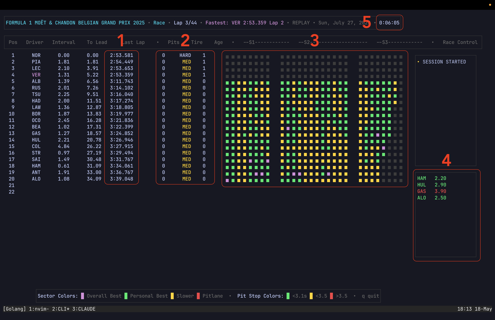

I recently completed my first test using Claude Code in an actual codebase and plan to run several more experiments over the next few weeks. This one was aimed at seeing how Claude Code handled generating full features without giving it super detailed instructions.

[The project](https://github.com/nstandage/Pitwall-TUI) I had it work on is a TUI app that replays F1 telemetry from historical races in real-time, simulating a live race. It’s a companion app for F1 races.

For this experiment, I had Claude Code work on 5 features:

1. **Last Lap** 
   - Shows the duration of the driver’s previous lap.
   - This feature didn’t work right off the bat, but Claude eventually got there. I used pretty vague instructions, so I wasn’t surprised it took some massaging.
2. **Pit Stop Count, Tire Compounds & Age**
   - Displays the number of pit stops a driver has completed, their current tire compound, and the number of laps on their current tires.
   - Claude had a harder time with this feature. I used a plugin called [Superpowers](https://claude.com/plugins/superpowers) to help me plan it, and while planning, Claude challenged my thinking a few times. I let it make the decisions to see how it handled them. After an initial pass, though, I needed to make several adjustments. The feature didn’t work like I wanted it to. After a few more passes, Claude got it right.
3. **Pit Stop Times**
   - Lists the most recent pit stop times in chronological order.
   - Claude one-shot this one.
4. **Sector Colors**
   - Each track has 3 sectors. Each of those 3 sectors has a varying amount of mini sectors, depending on the track. F1 Teams record the time it takes drivers to complete each mini sector and assign a color score:
        - Purple - best time overall
        - Green - driver’s personal best
        - Yellow - none of the above
   - I wanted Claude to calculate an estimate for how long each mini sector would take, then progressively fill in the mini sectors based on that estimate. This was the most impressive result to me. I needed to tweak one UI element (my fault), update one logic issue (also in the UI), and it worked perfectly after that. Super impressive.
5. **Race Timer**
   - A timer counting from the race start.
   - Claude one-shot this feature as well.

Overall, I think the experiment was successful, though imperfect. I learned more about how Claude Code works and its limitations. I’m not sure what the code looks like, but the features work (at least under basic testing), and it took me way less time than coding them by hand.

I’ve noticed one downside so far, though. After Claude did the first feature, I had a harder time reasoning about what it was showing me during the next four. I *theoretically* understood what it had done, but additions built on already-generated code weren’t as clear to me. Honestly, a lot of it I just assumed was correct and accepted. I’m worried that a larger codebase (this one’s fairly simple) could compound this lack of understanding. I’m reserving judgment on this, though. I’m still too new to have strong opinions, but I wanted to mention it.

Despite the few issues, my next experiment will be a deep dive into what Claude Code actually wrote to see how much I have to refactor. I’m worried for what I’ll find.
