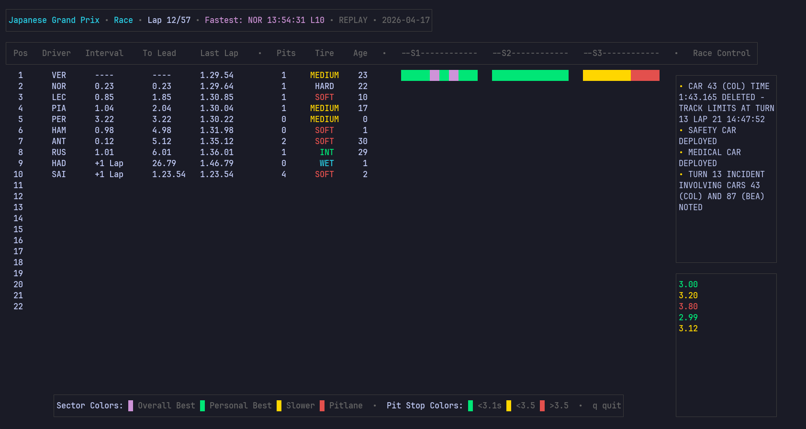

Technologies: `Go`, `BubbleTea`, `Lipgloss`, [OpenF1 API](https://openf1.org/)

Pitwall is a terminal UI app that replays data from historical F1 races as if they were live.

This is a work in progress.

#### What It Displays
* **Driver standings** — position, interval to car ahead, gap to race leader, and last lap time
* **Tire information** — current compound, tire age, and number of pit stops taken
* **Sector times** — color-coded sector performance that fills in progressively as drivers complete each sector *(only for historical races)*
* **Race control messages** — live feed of flags, penalties, VSC, and other official messages
* **Pit stop log** — most recent pit stops with stop duration and a color indicator for stop quality
⠀
#### Future Plans
Eventually, I’d like to have
* **Live race support** — currently works with historical races; live race support via WebSockets is next
* **Server-side architecture** — move data aggregation off the client and onto a cloud-deployed backend that streams race data to connected clients
* **Containerization** — Docker deployment, with Kubernetes as a stretch goal
* **iOS client** — longer-term possibility: a native SwiftUI app that consumes the same WebSocket stream
